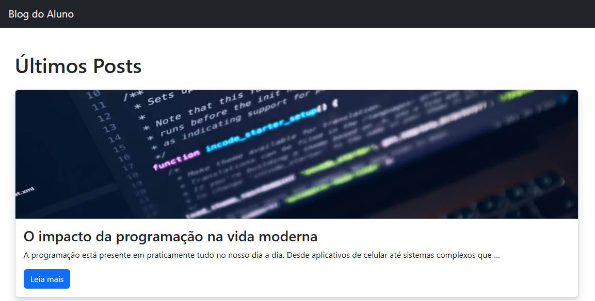
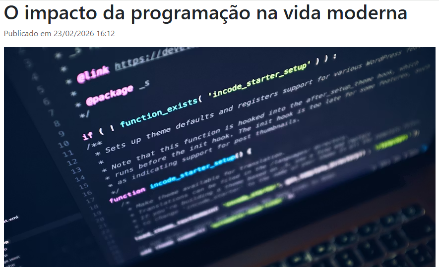
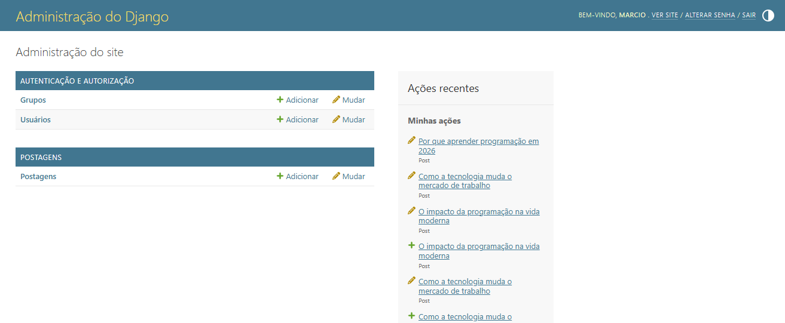

# 📝 Blog Django Profissional

Projeto de Blog desenvolvido com Django, com sistema completo de posts, imagens e paginação.

---

## 🚀 Funcionalidades

- ✔ Criação de posts via Django Admin
- ✔ Slug automático para URLs amigáveis
- ✔ Upload de imagens
- ✔ Paginação de posts
- ✔ Template base com herança
- ✔ Ordenação por data de publicação
- ✔ Página de detalhe com 404 automático

---

## 🛠 Tecnologias Utilizadas

- Python 3
- Django 5+
- SQLite3
- HTML5
- Bootstrap

---

## 📷 Demonstração

### Página inicial



### Página do post



### Painel administrativo



Sistema possui:

- Página inicial com listagem paginada
- Página de detalhe do post
- Upload e exibição de imagens

---

## ⚙️ Como rodar o projeto

Clone o repositório:

```bash
git clone https://github.com/marciocandidop1990-sys/blog-django.git

cd blog-django

python -m venv venv

venv\Scripts\activate

pip install -r requirements.txt

python manage.py migrate

python manage.py runserver
```